

# 📊 KANWISE 🛠

---

## THE IDEA BEHIND KANWISE 🤔

**KANWISE** is a project management tool based on the **KANBAN** methodology.

The project is built with Java 17 and Spring Boot and uses a microservice architecture to provide scalable and flexible
components for handling different aspects of the application. The primary goal of this project was to gain experience
with new challenges and utilize various technologies.

---

## TECH STACK 💻

KANWISE is built using the following technologies:

### Core 🌴

* Java 17
* Maven
* Spring Boot
* Lombok
* Angular

### Microservices 🪐

* Spring Cloud
* OpenFeign
* Kafka
* Docker
* Jib
* Resilience4j
* Spring Cloud Gateway

### Database 💾

* Spring Data
* Hibernate
* PostgreSQL
* Liquibase

### Security 🔐

* Spring Security
* JWT

### Communication 🌐

**KANWISE** uses **REST**ful communication to provide a standard interface for client-server interaction. The following
technologies are used to enable **REST**ful communication:

* Spring Web 🌐: for building web services
* Spring Validation ✅: for validating input data
* Spring HATEOAS 📖: for creating hypermedia-driven web services

### Features 🧪

* DigitalOcean Spaces 🌐: for object storage (AWS S3 API compatible)
* Passay 🔑: for password generation and validation
* Thymeleaf 🍃: for server-side HTML templating
* iText 📄: for generating PDF documents
* Google Common Cache 📦: for caching data

### Testing ✅

* JUnit5
* Mockito
* Testcontainers 🐳
* GreenMail 📬: for testing email functionality
* MockWebServer and WireMock 🌐: for testing HTTP clients
* Localstack 🌐: for testing AWS services
* Jacoco 🧪: for code coverage analysis

### Tools and Utilities 🧑‍💻

* SonarQube: for code quality and analysis
* Git: for version control

---

## FRONTEND 🖥️

While developing the backend services, I also built the frontend using Angular and primarily Material libraries.
As frontend development is not my primary area of expertise, I am still working on it,
and its source code still needs to be made available. However, it will serve as a visualization of the functions
and capabilities of the **KANWISE** tool.

---

**KANWISE** is designed as a microservices-based application with a scalable and efficient architecture consisting of
several small, independent services. The frontend application communicates with the API gateway, which manages and
directs requests to the appropriate services, ensuring efficient and effective communication within the application.

The following are the four primary services in **KANWISE**:

* **USER-SERVICE**: handles user management and security issues.
* **KANWISE-SERVICE**: manages all business logic related to projects and Kanban boards.
* **REPORT-SERVICE**: generates periodic performance and work result reports.
* **NOTIFICATION-SERVICE**:  handles notifications such as emails and SMS.

These services communicate using the REST protocol, WebClient, and OpenFeign. The **NOTIFICATION-SERVICE** is
linked with the rest of the components through a message broker, specifically **Kafka**,
enabling seamless communication and coordination between the services.

---

## API GATEWAY 🚪

The **API GATEWAY** in **KANWISE** is a crucial component that manages and directs requests to the appropriate service,
ensuring efficient communication between the different services. It also has
a [Resilience4J circuit breaker](api-gateway/src/main/java/com/kanwise/api_gateway/configuration/gateway/CircuitBreakerConfiguration.java)
configured to handle fault tolerance and implements
a [GatewayFilter as an authentication filter ](api-gateway/src/main/java/com/kanwise/api_gateway/filter/AuthenticationFilter.java)
to secure communication within the application.

The authentication filter performs a pre-validation of the **Authorization** header, which includes checking for the
presence of the "Bearer" prefix and ensuring that the header consists of two parts.
If the header passes this validation, the request is reactively redirected to the user service using a web client for
further JWT token validation.
The user service authenticates the token and, upon successful authentication, returns the username and role as headers
to be used for handling authorities within the microservice environment.

It's worth noting that the user service handles JWT token authentication in this project. However, in a more complex
application, it may be beneficial to have a separate service dedicated to authentication. A dedicated authentication
service allows for greater flexibility in the implementation of different authentication methods, such as OAuth2 or
Keycloak. This approach makes switching between other authentication implementations easier than implementing a specific
process from scratch.

In addition, using a managed API gateways service like AWS API Gateway or Kong can provide even more benefits. A managed
API gateway can offload the responsibility of handling requests and managing security from the individual microservices.
This allows for better separation of concerns and easier management of the overall system.

[Testing the JWT token validation](api-gateway/src/test/java/com/kanwise/api_gateway/filter/AuthenticationFilterIT.java)
in the API gateway was a challenging and exciting experience. A WireMockServer was used to create a stub for
simulating the response from the **USER-SERVICE**, and an instances supplier was defined to map the ports of the
WireMockService to the appropriate service identifier.
This configuration was necessary because the service's name was used in the API gateway's implementation rather than the
instance's port to enable load balancing.

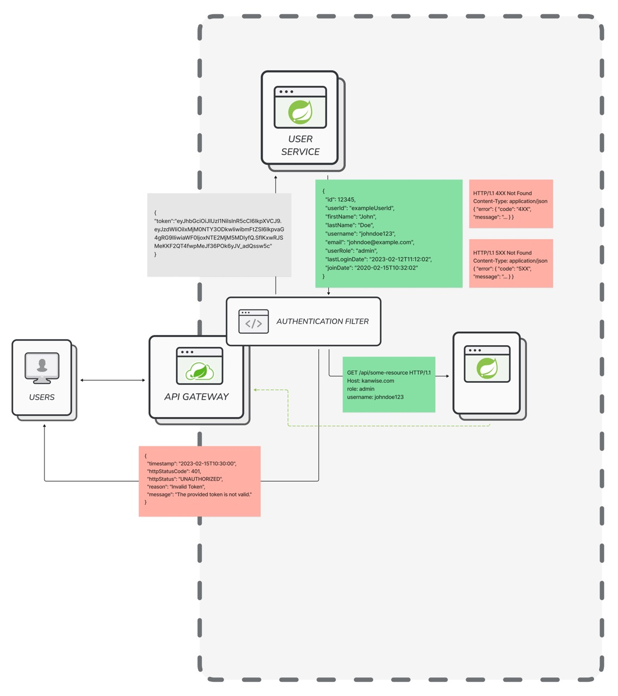

---

## USER SERVICE 👤

The **USER-SERVICE** in **KANWISE**  is a crucial component of the infrastructure, handling various user-related
functionality
such as registration, login, account management, and personal data management. The service also takes the validation
of JWT tokens for authentication.

### [USER REGISTRATION PROCESS](user-service/src/main/java/com/kanwise/user_service/controller/authentication/RegisterController.java) 📝

To register in **KANWISE**, users can utilize two-factor authentication using **Twilio**. During the registration
process, they
will be required to enter their information and receive an SMS with a code to complete the registration process. They
will also receive an email with a generated password in an HTML template.

A custom feedback mechanism was implemented to provide feedback on the delivery of SMS messages. It lets us know if the
SMS was delivered, is pending, or has failed.

#### Simplified registration process:

1. **User Registration Form** - This form requires users to fill out their personal information, including their name,
   email address, and phone number.

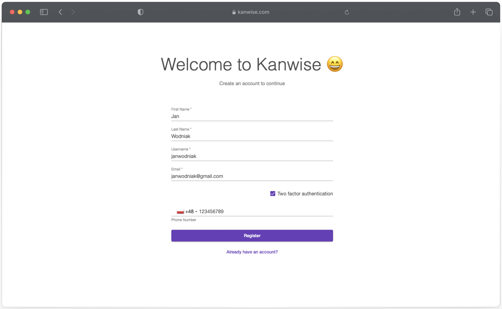

2. **OTP Verification Form** - Users will receive a verification code via SMS after completing the registration form.
   They must enter this code into a verification form to verify their phone number and complete the registration
   process.

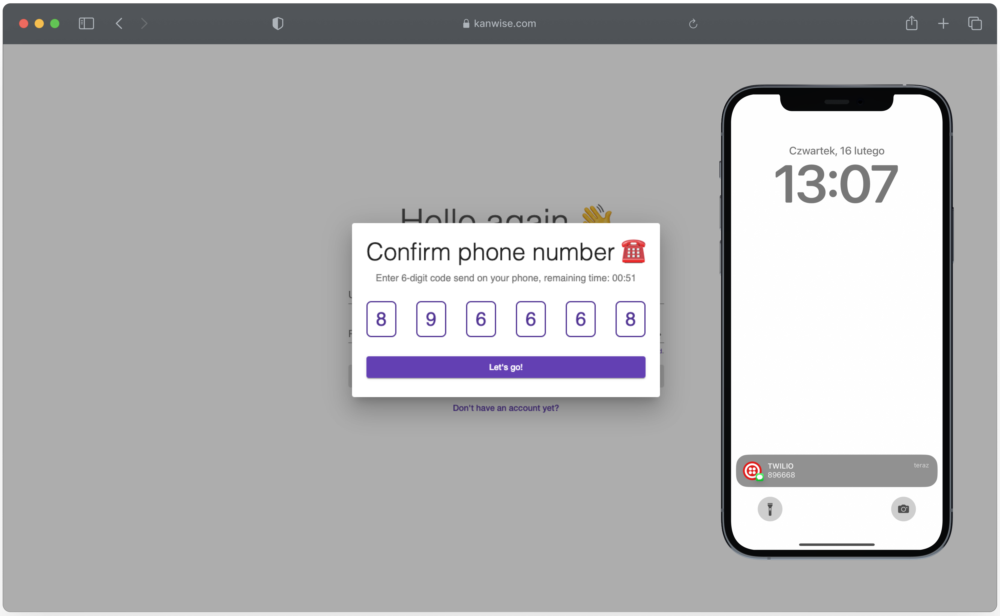

3. **Email Verification** - Users will receive an email with a generated password once they have completed the OTP
   verification process. The email is delivered in a sleek HTML template.

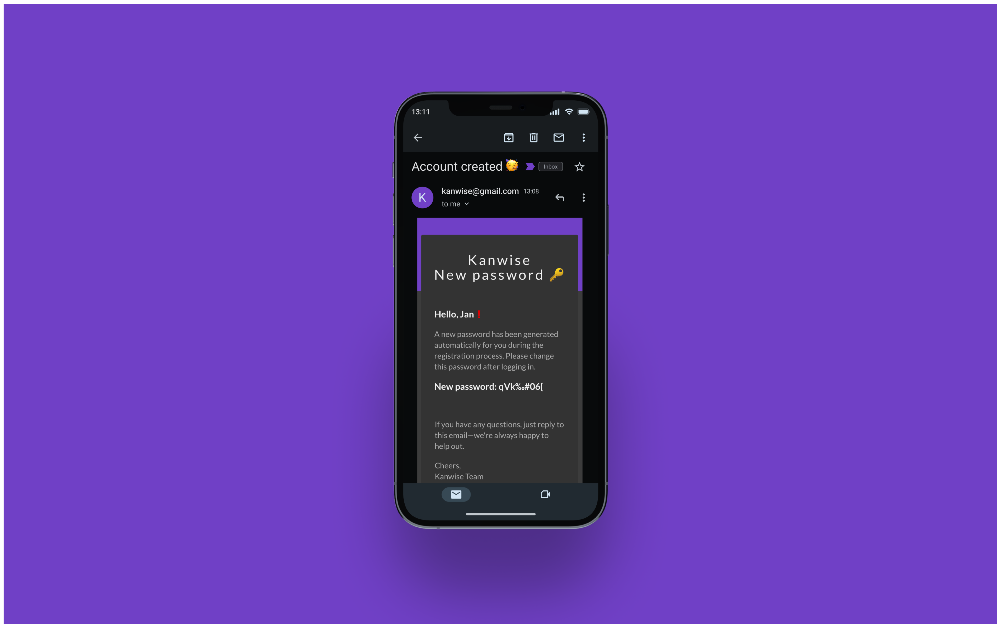

### [LOGIN](user-service/src/main/java/com/kanwise/user_service/controller/authentication/LoginController.java) 🔐

Implemented measures have been put in place to ensure security, which includes protection against brute force attacks.
Registered users can use their username and password to access the system. Successful authentication results in
receiving a JWT token that can be utilized for authenticated requests. Tracking the number of attempts and the time
until attempts reset is accomplished using cache. The configuration can be customized to meet the specific needs of the
application.

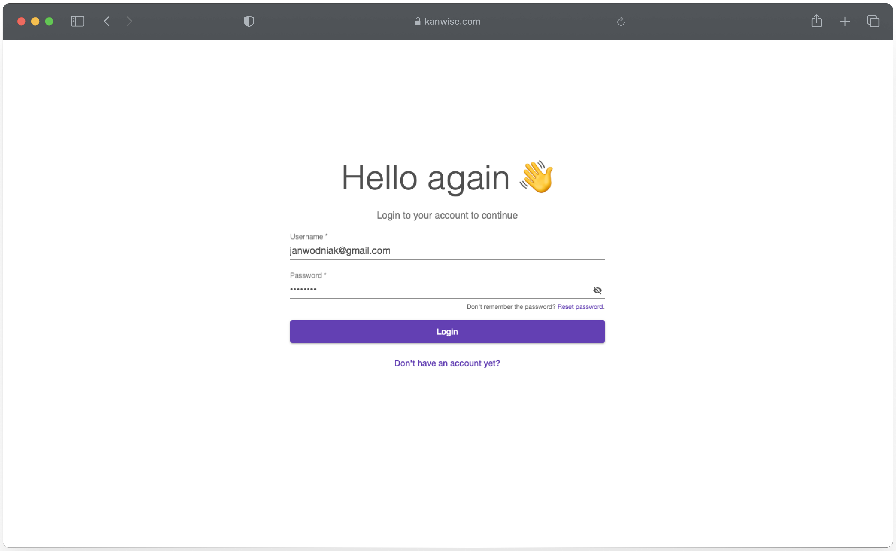

### [FORGOTTEN PASSWORD](user-service/src/main/java/com/kanwise/user_service/controller/authentication/PasswordController.java) 🔑

Users who forget their password can initiate a password reset process. They will receive an email with a link containing
an OTP,
which can be used to reset the password. When the user follows the link and enters a new password that meets specific
requirements,
the frontend will intercept the OTP and use it in a request to reset the password. The OTP has a configurable expiration
time.

1. **Password Reset Request** - Users can initiate a password reset process by entering their email addresses.
   They will receive an email with a link containing an OTP, which can be used to reset the password.

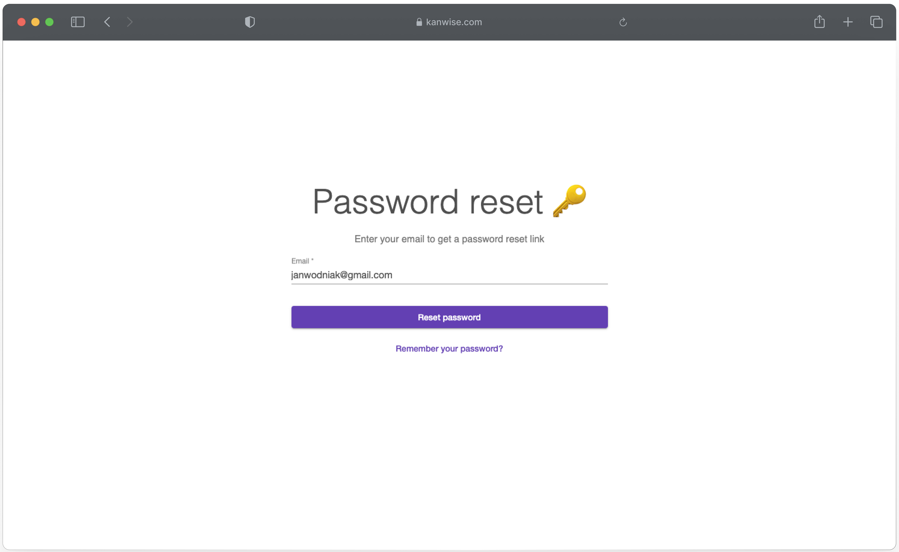

2. **Password Reset Form** - Users will enter a new password that meets specific requirements.
   The frontend will intercept the OTP and use it in a request to reset the password.

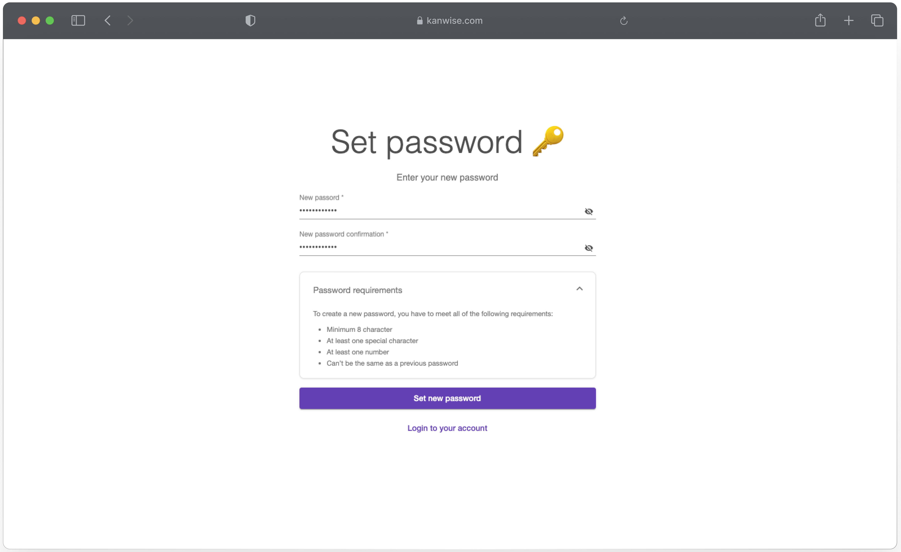

### [USER MANAGEMENT](user-service/src/main/java/com/kanwise/user_service/controller/user) 🧑‍💼

In addition to standard CRUD operations for the user entity, users can also upload profile pictures stored in Digital
Ocean's Spaces service. I have implemented pagination in our CRUD operations to manage large datasets efficiently.
Users can specify the number of items they want to retrieve per page and the page number they want to recover.
This makes it easier to manage large datasets and improves the system's performance.

1. **User Account** - Users can view their account information and update their profile picture.

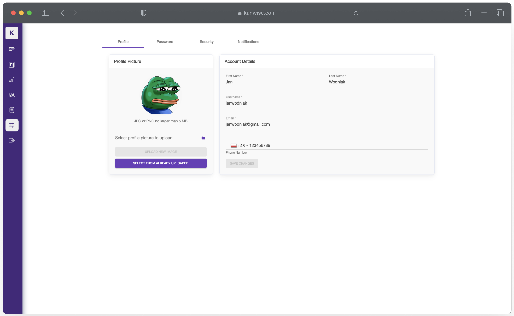

2. **User Password** - Users can update their password.

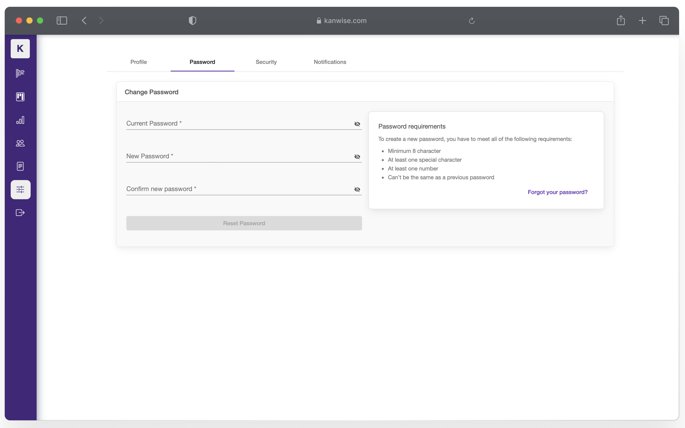

3. **User Two-Factor Authentication** - Users can enable or disable two-factor authentication.

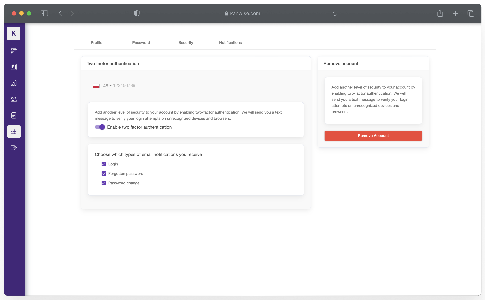

4. **User Notification** - Users can enable or disable email notifications.

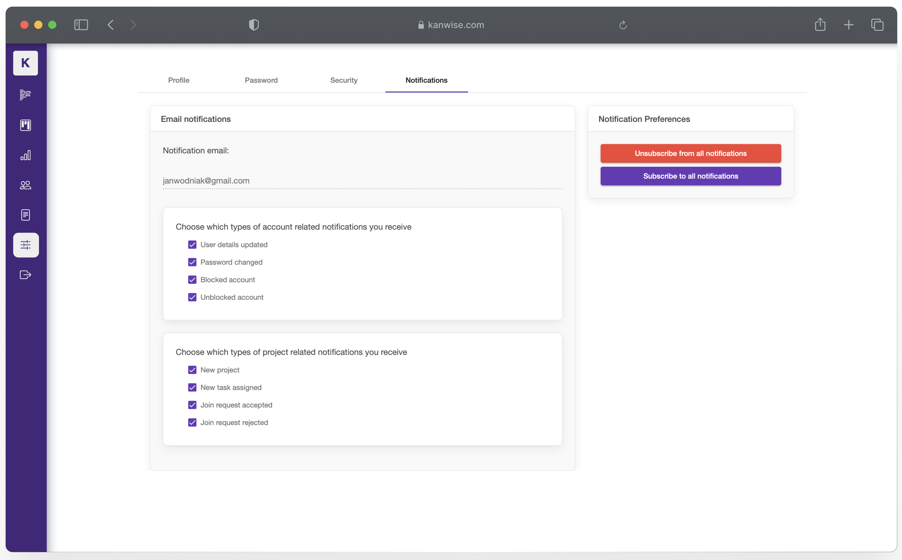

---

## KANWISE SERVICE 📊

Now that we've successfully logged in, we're taken to the part of the application that is primarily managed by the
**KANWISE-SERVICE**. This service is responsible for handling the business logic for project management. We can join
existing projects or create our own in the Projects section. Once we become a project members, we have access to the
Kanban board, where we can manage project tasks.

### [PROJECTS](kanwise-service/src/main/java/com/kanwise/kanwise_service/controller/project) 📋

On the Projects page, users can view a list of existing projects and create new ones. To create a new project,
click the "Add Project" button and fill out the project information form, including the project name, description,
and team members. Once the project is created, users can invite team members to join the project, assign tasks, and
track progress on the Kanban board.

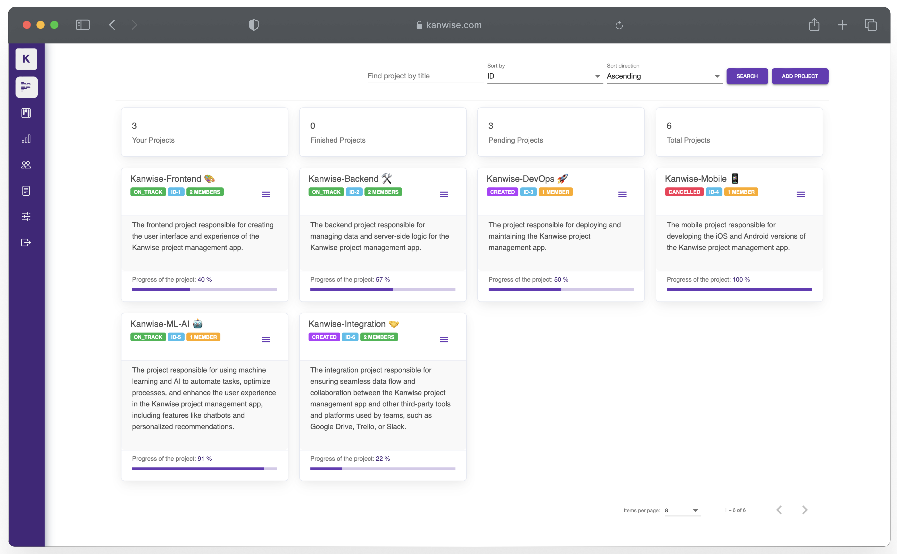

### PROJECT MANAGEMENT 📈

Once the project is created or joined, users are taken to the project page, where they can see all the project details,
such as the project name, description, team members, and the Kanban board. They can add tasks to the board, move tasks
between columns, and assign tasks to team members.

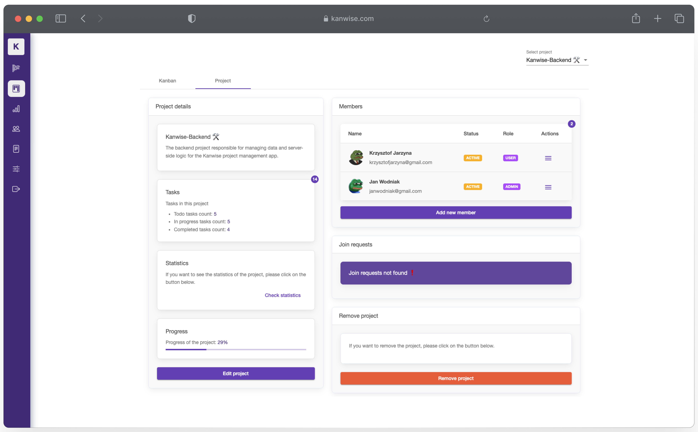

### [KANBAN BOARD ](kanwise-service/src/main/java/com/kanwise/kanwise_service/controller/task)📌

The Kanban board is where we can manage the project tasks. It consists of several columns, such as "**To Be Done**",
"**In Progress**", and "**Done**". We can move tasks between the columns by dragging and dropping them into the
appropriate column.

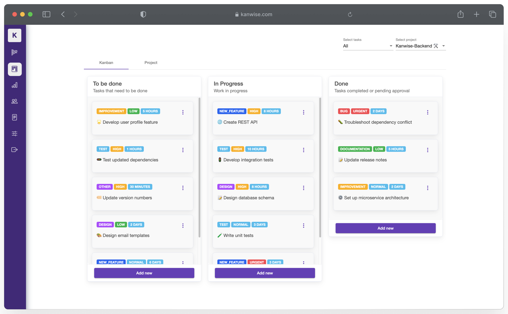

#### TASK CREATION 📝

The task creation process in the Kanban board is a crucial step in project management. Click the "**Add new**" button on
the Kanban board to add a new task. This will bring up a form where we can enter all the necessary
information, such as the task name, description, assignee, type, and expected completion time. Once we have completed
the form, we can click "**Create**" to add the task to the board. This allows for better task organization and
management, ensuring that all team members know what needs to be done, who is responsible for each task, and when it is
due.

#### TASK DETAILS 📄

Once the task has been added, we can see it on the Kanban board in the appropriate column based on its status. We can
click on the task to see its details, such as the task name, description, assignee, type, expected completion time, and
task history.

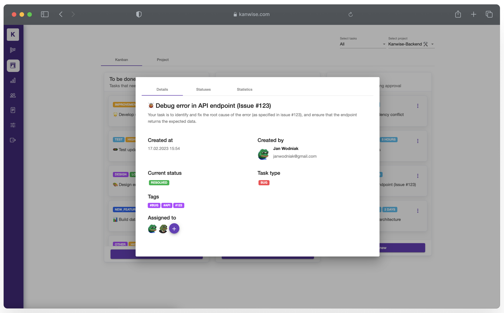

#### TASK STATUSES 🚦

We can change the task status by dragging and dropping it into a new column on the Kanban board. This action will
be recorded in the task's history section.

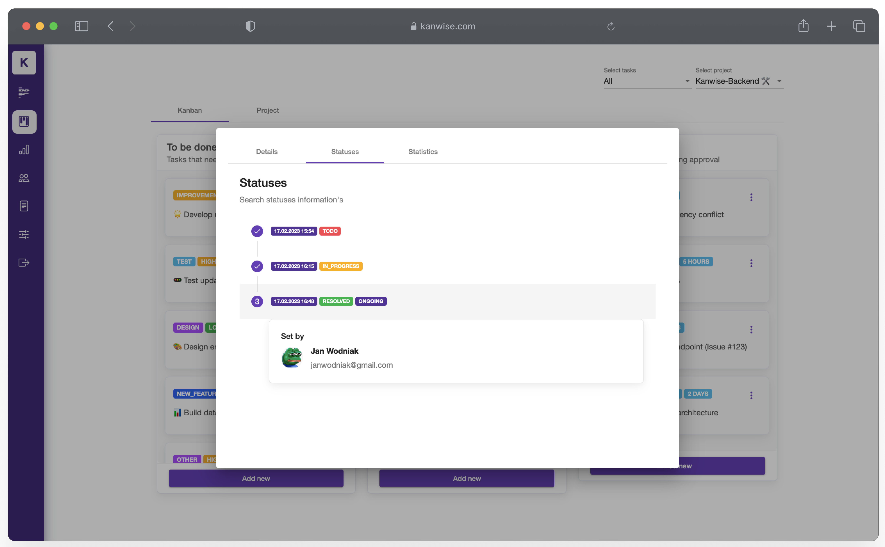

#### TASK STATISTICS 📊

The task's statistics section provides valuable information about the task's progress. It shows the time the mission
has been active, the time spent working on it, and the time spent in the todo column compared to the expected
completion time. This information can help track the progress of tasks and understand how much time is spent on
different tasks.

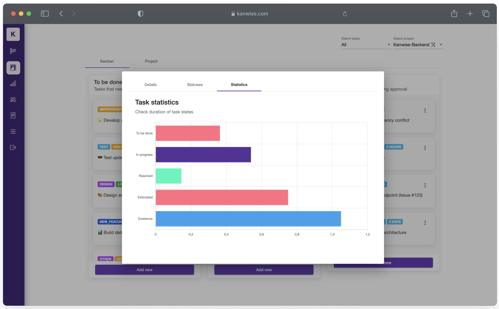

### USER STATISTICS 📊

The user statistics section provides valuable insights into the user's performance within the **KANWISE** platform. By
analyzing this data, users can track their progress and understand how much time they spend on different tasks.

In addition to personal statistics, users can view project-level statistics showing the task distribution by type and
the number of tasks assigned in each project. This information can be helpful for project management and
identifying areas where additional resources may be needed.

To display this data, Chart.js charts in the frontend provide a visually appealing and user-friendly way to view and
analyze the information.

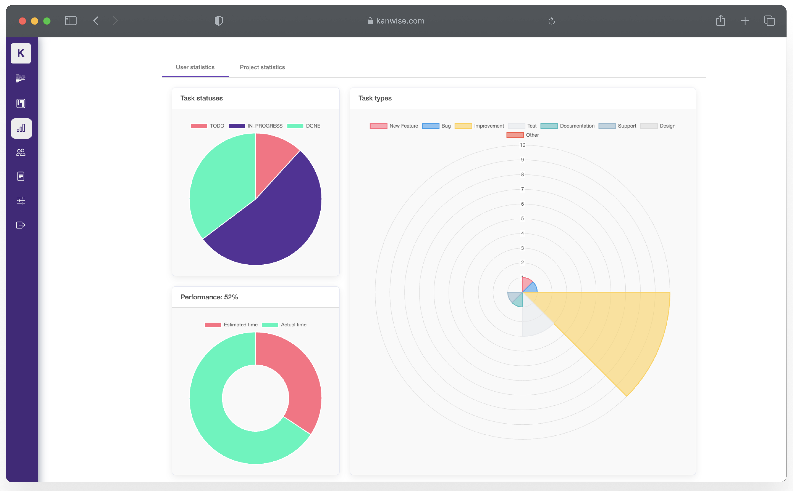

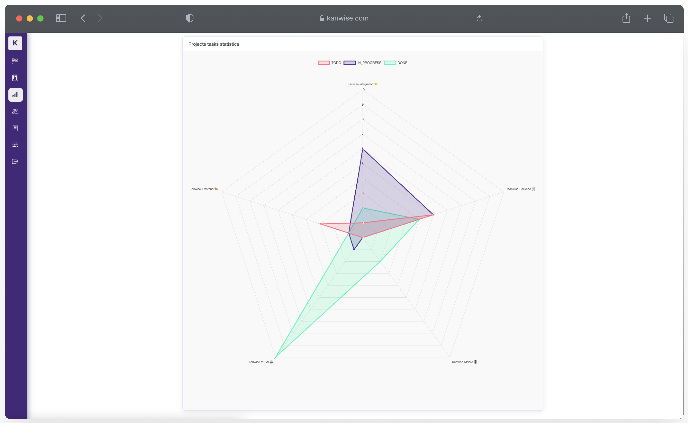

---

## REPORT SERVICE 📈

The report service provides one of the most exciting features of the **KANWISE** application. We have access to a job
creator in the reports tab, allowing us to create personal and project-level reports. These reports provide information
about our performance and can be delivered as a download link to our email.

### PERSONAL REPORT 📊

The personal report shows our progress over time, including our completed tasks, the time we've spent on each task, and
any other metrics we might be interested in. This is a great way to see our progress and identify improvement areas.

### PROJECT REPORT 📊

With the project report, we can see how the entire team is doing on a project. This includes data on completed tasks,
time spent on each task, and other essential metrics. This allows us to identify any bottlenecks in the project and make
adjustments to improve efficiency.

### JOB CREATOR ⏰

The job creator allows us to create custom reports that fit our needs. We can choose the type of report, the reporting
period, the scope of the information, and the frequency of the report. This allows us to create personal or
project-level reports, and we can choose the frequency of the report, such as daily, weekly, or monthly.
Additionally, custom Cron operations, delays, offsets, and fire count are supported in the job creator, giving us even
more flexibility and control over the reporting process.

The scheduling job is an integral part of the **REPORT-SERVICE** as it allows us to run the job at the desired time and
frequency, making it easier to manage and analyze the data. The job creator provides a simple and easy way to create.

### [JOBS DASHBOARD](report-service/src/main/java/com/kanwise/report_service/controller/job/personal/PersonalReportJobController.java) 🕒

In the user's jobs dashboard, we can view all the jobs created and their current status. We can stop a job if needed,
rerun a job, and go to the job details page. This provides a simple and easy way to manage and monitor the jobs created
using the creator.

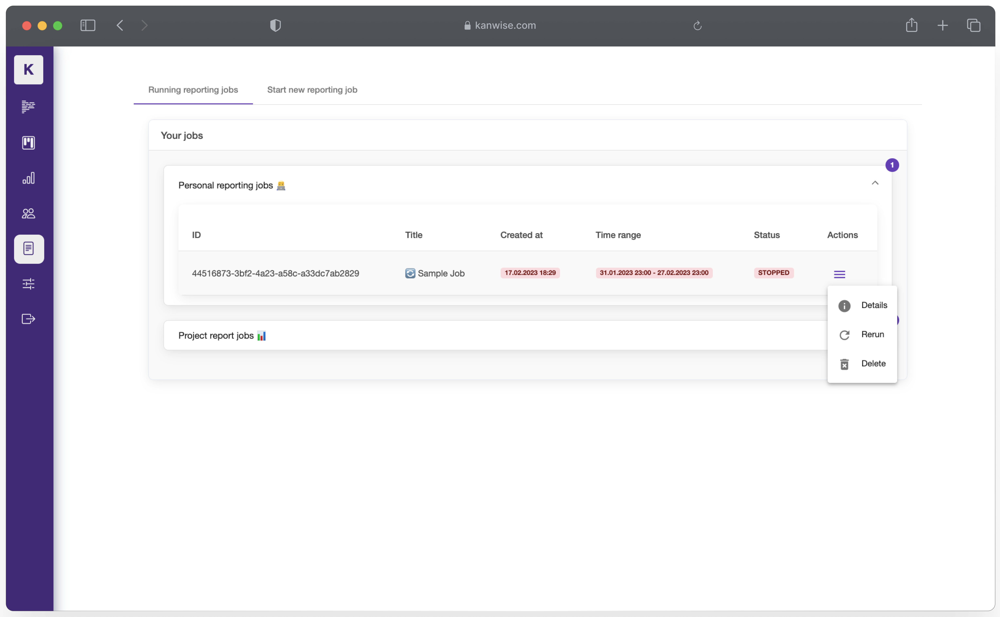

#### JOB DETAILS 📄

The job details page provides more information, including the job name, type, and status.

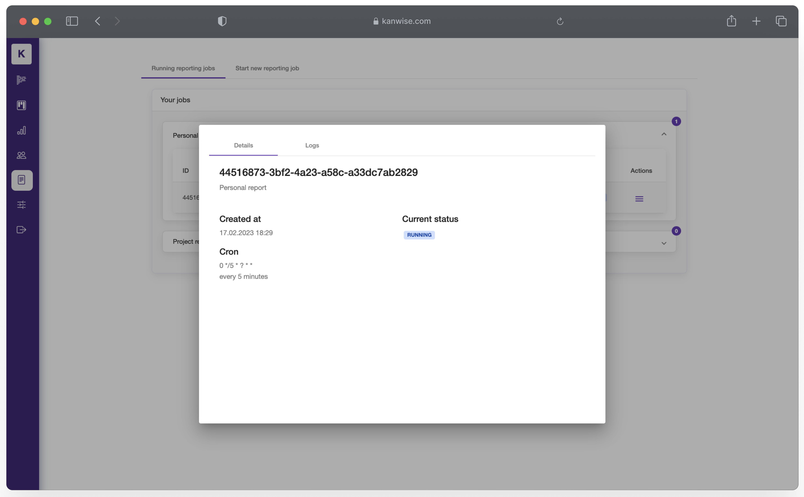

#### [REPORT LOGS](report-service/src/main/java/com/kanwise/report_service/controller/job/personal/monitoring/PersonalReportJobMonitoringController.java) 📜

Once a job has been created and executed, we can access its logs to see the stages of the periodic task's life cycle.
This information can help debug and troubleshoot any issues with the job. We can download the report directly from the
job page if the job is successfully executed.

The jobs can be paused, resumed, and deleted, and everything is powered by the Quartz library, which is a powerful tool
for running periodic tasks in a microservice environment.

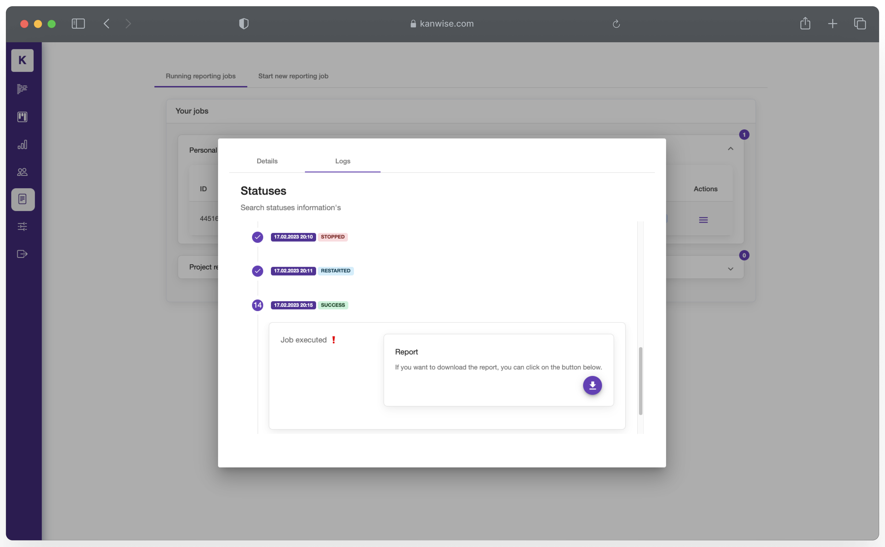

### CLUSTERING 📡

It's worth noting that when running multiple instances of the report service, we need to synchronize the jobs to ensure
that each job is only executed once, and this synchronization is done on the database level. Quartz also provides job
recovery functionality to reschedule any missed or failed jobs automatically.

### KUBERNETES CRON JOBS 🕰️

While Quartz is a powerful tool for running periodic tasks, there may be better solutions for some use cases,
especially in a Kubernetes environment. In a Kubernetes environment, we can leverage the Kubernetes scheduling
functionality to run periodic tasks using Cron jobs or other Kubernetes primitives. This managed solution
provides additional benefits, such as automatic scaling and high availability, and it can help streamline the deployment
and management of our application. However, using Quartz in the **KANWISE** application was a thrilling challenge and
experiment that provided valuable insights into running periodic tasks in a microservice environment. By exploring
different tools and techniques, we can find the best solution for our specific use case and optimize our
application for performance and scalability.

---

## NOTIFICATIONS 📫

The **NOTIFICATION-SERVICE** provides email and SMS notifications to keep users informed about important events and
updates
related to their projects. Notifications are triggered by listeners that are set up to monitor specific events or
changes in the system. When a listener detects an event or change that requires user attention, it generates a
notification and sends it to the intended recipient.

### [EMAIL NOTIFICATIONS](notification-service/src/main/java/com/kanwise/notification_service/listeners/email/implementation/KafkaEmailListener.java) 📧

The project leverages Java Mail Sender to send emails to users. The notification service performs HTML templating to
format and adequately delivers the notification to the intended recipient. This approach allows for the customization of
email notifications to meet specific needs.

### [SMS NOTIFICATIONS](notification-service/src/main/java/com/kanwise/notification_service/listeners/sms/implementation/KafkaSmsListener.java) 📱

To reach users through SMS messages, the project uses Twilio API. The notification service delivers the notification to
the intended recipient and provides a custom feedback mechanism to track the message delivery status.
This information can be helpful for troubleshooting and ensuring that users receive their notifications promptly.

---

## TESTING ✅

In the development of the **KANWISE** project, I placed a strong emphasis on integration testing to ensure the
reliability
and correctness of the code. I created nearly 800 tests with different scenarios to thoroughly exercise the various
components of the system.

### TEST ENVIRONMENT SETUP

To set up the appropriate test environment, I used a combination of tools to provide a clear state for each test, and
ensure that they are isolated and do not interfere with one another.

### LIQUIBASE AND DATABASE MANAGEMENT

I used Liquibase with custom database management and cleaning to provide a clear state for each test. This allowed me to
easily set up and tear down the required resources for each test, ensuring that they are isolated and do not interfere
with one another.

### AVOIDING N+1 QUERY PROBLEM

I also used Spring Hibernate Query Utils to identify and resolve N+1 query issues, which can cause performance problems.
These utilities help to optimize database queries by reducing the number of queries executed and minimizing data
transfer between the database and the application.

### DISABLING OPEN IN VIEW

To improve performance, I disabled the Open in View functionality in Spring. This prevents the automatic opening of a
Hibernate session for each HTTP request, leading to unnecessary database queries and impacting application performance.

### AVOIDING @TRANSACTIONAL ON TESTS

To ensure that my tests were consistent and reliable, I avoided using the @Transactional annotation on tests. This
allowed me to control the state of the database for each test and to ensure that changes made during one test did not
affect the results of subsequent tests.

### TESTCONTAINERS

In addition, I employed Testcontainers to instantiate Kafka and Postgres. Testcontainers allowed me to quickly spin up
these resources within a Docker container without manually setting up and configuring them on my local machine. This
made creating a consistent testing environment accessible across multiple machines and environments.

### LOCALSTACK

I used Localstack to mock Digital Ocean Spaces using the S3 API. This allowed me to test the functionality of the
**KANWISE** that relied on Digital Ocean Spaces in a local environment without incurring any actual Digital Ocean
costs.

### MOCKING EXTERNAL APIS

To test the functionality of the **KANWISE** project in a more controlled and reliable manner, I also used
WireMockServer to
mock external APIs like Twilio. This helped me simulate these external dependencies' behavior without relying on them.
Using WireMockServer allowed me to test the functionality of the Kanwise project more confidently,
knowing that the behavior of external APIs was being accurately simulated.

--- 

## DOCUMENTATION 📚

In the **KANWISE** project, Swagger generated documentation for the APIs, allowing for easy sharing of API
specifications
with other developers and stakeholders. Swagger documented the endpoints, parameters, responses, and
error codes for each API and provided sample requests and responses, making it easy for other developers to understand
Test the APIs' purpose and usage using the Swagger UI interface.

However, due to some security vulnerabilities in the Actuator component of Spring Boot, which Swagger uses, a migration
to Spring Docs for API documentation is planned shortly.

---

AND WHAT'S NEXT ⏰

The **KANWISE** project has been a challenging and rewarding experience, and I am proud of what I have accomplished so
far.
However, I recognize that the project could be better and that there is still work to improve its functionality,
performance, and security.

In terms of future work, I plan to continue to improve the codebase, adding new features and refining existing ones.
I want to increase the code coverage to 100%, a standard I strive for in all my projects. Additionally, I plan to
improve code quality by addressing technical debt and implementing best practices and design patterns where appropriate.

One central area of focus for future development will be the addition of an authentication service, which will help to
improve the security of the application and provide a more seamless user experience.

I also plan to upgrade the documentation using Spring Docs, providing a more secure and reliable way to generate API
documentation for the project. This will help ensure accurate and up-to-date documentation, which is essential for
effective communication and collaboration.

In terms of monitoring, I plan to implement tools such as Prometheus and Grafana to provide more comprehensive insights
into the performance and behavior of the application, which will help to identify and resolve any issues that arise.

To further elaborate, the overall code coverage for the **KANWISE** is currently at 85%, which is good for now, with
most services being at 95-100%. However, the report service is below that at 70%. This is an area of focus for future
development, and I plan to thoroughly test and improve the project report features to increase the code coverage in this
service.

Regarding security, the **KANWISE** already has some authorization implemented, and appropriate access levels for
roles have been set. However, I plan to improve this by refining the authorization and access
control mechanisms and adding more validation and secure communication measures such as API keys and encoding
for message brokers, WebClient, and OpenFeign.

Overall, the **KANWISE** project has been a valuable learning experience, and I am excited to continue developing and
refining the application. While I am proud of what I have accomplished so far, I recognize that there is always room for
improvement, and I am committed to addressing any issues and enhancing the functionality and reliability
of the application.

---

## STARTING THE APPLICATION 🚀

Prerequisites:

- Docker installed on your local machine.
- Digital Ocean Spaces account and necessary credentials.
- Twilio account and necessary credentials.
- Email account and necessary credentials.
- Maven or your preferred build tool
- IDE for running the Spring Boot applications.

### Option 1️⃣

#### Start the app with Docker and [kanwise-docker.yml](kanwise-docker.yml) file.

1. Clone the repository to your local machine.
2. Navigate to the root directory of the project.
3. Ensure the configuration properties are appropriately set in the [kanwise-docker.yml](kanwise-docker.yml) file. The
   following properties
   need to be configured for each service:

**REPORT-SERVICE:**

    env:
      - DO_SPACES_ENDPOINT= Your Digital Ocean Spaces endpoint, example: fra1.digitaloceanspaces.com
      - DO_SPACES_SECRET_KEY= Your Digital Ocean Spaces secret key
      - DO_SPACES_REGION= Your Digital Ocean Spaces region, example: fra1
      - DO_SPACES_ACCESS_KEY= Your Digital Ocean Spaces access key

**NOTIFICATION-SERVICE:**

    env:
      - TWILIO_ACCOUNT_SID= Your Account SID from www.twilio.com
      - TWILIO_AUTH_TOKEN= Your Auth Token from www.twilio.com
      - TWILIO_NUMBER= Your Number from www.twilio.com
      - MAIL_USERNAME= Your email address
      - MAIL_PASSWORD= Your password for email (generated access token)

**USER-SERVICE:**

    env:
      - DO_SPACES_ENDPOINT= Your Digital Ocean Spaces endpoint, example: fra1.digitaloceanspaces.com
      - DO_SPACES_SECRET_KEY= Your Digital Ocean Spaces secret key
      - DO_SPACES_REGION= Your Digital Ocean Spaces region, example: fra1
      - DO_SPACES_ACCESS_KEY= Your Digital Ocean Spaces access key

4. Open a terminal window and navigate to the project's root directory.
5. Run the following command to start all the necessary services:

   `docker-compose -f kanwise-docker.yml up -d`

6. Wait for the services to start. This may take a few minutes, depending on your machine's configuration.
   Once all the services have started, you can access the application at http://localhost:4200.

#### Option 2️⃣: Start the app with Maven and [docker-compose.yml](docker-compose.yml) file.

If you prefer to start the **KANWISE** app using Maven and Docker, you can follow these steps:

1. Clone the repository to your local machine.
2. Navigate to the root directory of the project.
3. Fill in the `application.yml` files with the required access credentials. Fill in files with the necessary
   access credentials. The required properties are marked with TODO in the file and include information such as API
   keys, secret tokens, and database credentials.
4. Open a terminal window and navigate to the root directory of each Spring Boot application in the project.
5. Run the following command to build the JAR file for each application:

   `mvn clean package` - crossing my fingers and hoping there won't be a need for the SkipTests flag, haha 🤞😂

6. Execute the [docker-compose.yml](docker-compose.yml) file to start the other required services and components, such as the PostgreSQL
   database and the Kafka messaging system:

   `docker-compose -f docker-compose.yml up -d`

7. Alternatively, you can also run the services directly from your IDE by configuring the project's properties and
   running the main method of each application.

8. Wait for the services to start. This may take a few minutes, depending on your machine's configuration.

9. Once all the services have started, you can access the application at http://localhost:4200.

**Note**:
To initialize the databases for each service, ensure the script directory is present in the project's root directory.
The initialization scripts will be automatically executed when the PostgreSQL container starts.

That's it! You now have two options to start the application, depending on your preference and familiarity with the
technologies involved. Running the application with Maven and Docker can be a convenient and straightforward
way to set up and run the app. Alternatively, you can also run the services directly from your IDE by configuring the
project's properties and running the main method of each application.

